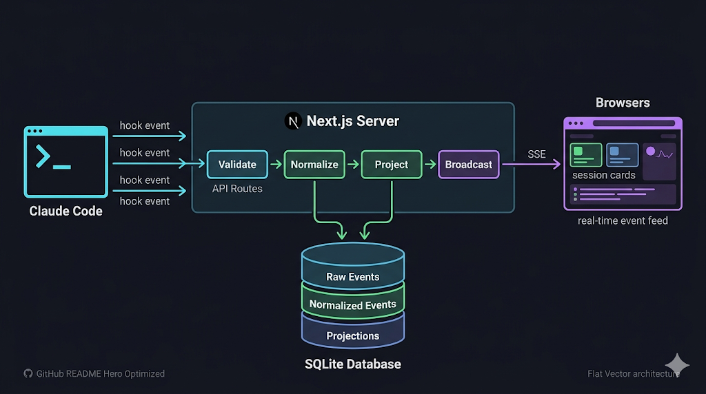

<h1 align="center">Claude Monitor</h1>

<p align="center">Claude Code 세션을 실시간으로 모니터링하는 웹 대시보드</p>

<p align="center">
  Claude Code Hook을 통해 세션, 도구 실행, 태스크, 에이전트 이벤트를 수집하고,<br/>
  웹 브라우저에서 실시간으로 확인할 수 있습니다.
</p>



## 스크린샷

### Dashboard
세션 목록, 활성 세션/도구/알림 통계, 실시간 상태 업데이트

### Session Detail
세션 메타데이터, Tool/Task/Agent 탭, 최근 메시지 표시

### Event Timeline
전체 이벤트 시간순 흐름, 카테고리/시간 필터

## 주요 기능

- **10개 Hook 엔드포인트** — Claude Code 이벤트 실시간 수집
- **Event-First 아키텍처** — Raw → Normalized → Projection 파이프라인
- **5개 Projection** — Session, Tool, Task, Agent, Alert 상태 추적
- **6개 UI 화면** — Dashboard, Session Detail, Tool Timeline, Tasks & Agents, Alerts, Event Timeline
- **SSE 실시간 업데이트** — 페이지 새로고침 없이 상태 반영
- **Heartbeat + Stale 감지** — 비활성 세션 자동 알림
- **Idempotent 수집** — 중복 이벤트 자동 제거

## 아키텍처

```
Claude Code (Hooks)
    │
    ▼
Next.js API Routes (수집 + 정규화)
    │
    ▼
SQLite (WAL mode)
  ├─ raw_events (원본 보존)
  ├─ events (정규화)
  └─ *_current (Projection)
    │
    ▼
SSE → Dashboard UI
```

## 기술 스택

| 계층 | 기술 |
|------|------|
| Framework | Next.js 15 (App Router) |
| Database | SQLite (better-sqlite3, WAL mode) |
| ORM | Drizzle ORM |
| UI | shadcn/ui + Tailwind CSS |
| 실시간 | Server-Sent Events (SSE) |
| 언어 | TypeScript |

## 시작하기

### 1. 설치

```bash
git clone https://github.com/ldmrepo/claude-monitor.git
cd claude-monitor
npm install
```

### 2. 실행

```bash
npm run dev
```

`http://localhost:3000`에서 대시보드가 열립니다. SQLite DB는 `data/claude-vault.db`에 자동 생성됩니다.

### 3. Claude Code Hook 설정

Hook 설정 JSON을 자동 생성합니다:

```bash
npx tsx scripts/generate-hooks-config.ts 3000
```

출력된 JSON을 `.claude/settings.json`에 추가하세요:

```json
{
  "hooks": {
    "SessionStart": [
      { "hooks": [{ "type": "http", "url": "http://127.0.0.1:3000/api/hooks/session-start" }] }
    ],
    "PreToolUse": [
      { "matcher": ".*", "hooks": [{ "type": "http", "url": "http://127.0.0.1:3000/api/hooks/pre-tool" }] }
    ],
    "PostToolUse": [
      { "matcher": ".*", "hooks": [{ "type": "http", "url": "http://127.0.0.1:3000/api/hooks/post-tool" }] }
    ],
    "PostToolUseFailure": [
      { "matcher": ".*", "hooks": [{ "type": "http", "url": "http://127.0.0.1:3000/api/hooks/post-tool-failure" }] }
    ],
    "SubagentStart": [
      { "hooks": [{ "type": "http", "url": "http://127.0.0.1:3000/api/hooks/subagent-start" }] }
    ],
    "SubagentStop": [
      { "hooks": [{ "type": "http", "url": "http://127.0.0.1:3000/api/hooks/subagent-stop" }] }
    ],
    "TaskCreated": [
      { "hooks": [{ "type": "http", "url": "http://127.0.0.1:3000/api/hooks/task-created" }] }
    ],
    "TaskCompleted": [
      { "hooks": [{ "type": "http", "url": "http://127.0.0.1:3000/api/hooks/task-completed" }] }
    ],
    "Stop": [
      { "hooks": [{ "type": "http", "url": "http://127.0.0.1:3000/api/hooks/stop" }] }
    ],
    "SessionEnd": [
      { "hooks": [{ "type": "http", "url": "http://127.0.0.1:3000/api/hooks/session-end" }] }
    ]
  }
}
```

### 4. 테스트 데이터로 확인

데모 세션 시뮬레이션:

```bash
npx tsx scripts/test-ingest.ts 3000
```

## 화면 구성

| 경로 | 화면 | 설명 |
|------|------|------|
| `/` | Dashboard | 활성 세션, 통계 카드, 세션 목록 |
| `/sessions/[id]` | Session Detail | 세션 메타 + Tool/Task/Agent 탭 |
| `/tools` | Tool Timeline | 전체 도구 실행 이력, 상태 필터 |
| `/tasks` | Tasks & Agents | 태스크 목록, 에이전트 목록 |
| `/alerts` | Alerts | 활성 알림, 이력, Acknowledge |
| `/events` | Event Timeline | 시간순 이벤트, 카테고리/시간 필터 |

## API 엔드포인트

### Hook 수집 (POST)

| 엔드포인트 | Claude Code 이벤트 |
|-----------|-------------------|
| `/api/hooks/session-start` | SessionStart |
| `/api/hooks/stop` | Stop |
| `/api/hooks/session-end` | SessionEnd |
| `/api/hooks/pre-tool` | PreToolUse |
| `/api/hooks/post-tool` | PostToolUse |
| `/api/hooks/post-tool-failure` | PostToolUseFailure |
| `/api/hooks/subagent-start` | SubagentStart |
| `/api/hooks/subagent-stop` | SubagentStop |
| `/api/hooks/task-created` | TaskCreated |
| `/api/hooks/task-completed` | TaskCompleted |

### 조회 (GET)

| 엔드포인트 | 설명 |
|-----------|------|
| `/api/sessions` | 세션 목록 |
| `/api/sessions/[id]` | 세션 상세 (tools, tasks, agents 포함) |
| `/api/tools` | 도구 실행 목록 (`?state=`, `?sessionId=`) |
| `/api/tasks` | 태스크 목록 |
| `/api/agents` | 에이전트 목록 |
| `/api/alerts` | 알림 목록 |
| `/api/events` | 이벤트 목록 (`?category=`, `?severity=`, `?sessionId=`, `?since=`) |
| `/api/sse` | Server-Sent Events 스트림 |
| `/api/health` | 서버 상태 + DB 통계 |

## 데이터 모델

8개 SQLite 테이블:

| 테이블 | 역할 |
|--------|------|
| `raw_events` | 원본 Hook JSON 보존 |
| `events` | 정규화된 표준 이벤트 |
| `session_current` | 세션 상태 Projection |
| `tool_exec_current` | 도구 실행 상태 Projection |
| `task_current` | 태스크 상태 Projection |
| `agent_current` | 에이전트 상태 Projection |
| `alert_current` | 알림 상태 Projection |
| `processor_checkpoint` | 처리 위치 관리 |

## 테스트

```bash
npm test          # 19개 단위 테스트 실행
npm run test:watch  # 감시 모드
```

## 보안

이 도구는 **localhost 전용**으로 설계되었습니다. 인증/인가가 없으므로 외부 네트워크에 직접 노출하지 마세요.

원격 접속이 필요하면:
- Tailscale 또는 VPN 사용
- SSH 포트 포워딩: `ssh -L 3000:localhost:3000 your-machine`

자세한 내용은 [SECURITY.md](SECURITY.md)를 참조하세요.

## 프로젝트 구조

```
src/
  db/           # SQLite 연결, 스키마, 마이그레이션
  lib/          # 공유 유틸 (ID 생성, 상수, 타입)
  server/
    ingest/     # 이벤트 검증, 정규화
    projection/ # Projection 업데이트 (session, tool, task, agent, alert)
    pipeline.ts # 메인 수집 파이프라인
    sse.ts      # SSE 브로드캐스트
    heartbeat.ts # Stale 감지
  app/
    api/hooks/  # 10개 Hook 수신 엔드포인트
    api/        # 조회 API
    *.tsx       # 6개 UI 화면
  components/   # React 컴포넌트
  hooks/        # React Hooks (SSE)
scripts/
  generate-hooks-config.ts  # Hook 설정 생성기
  test-ingest.ts            # 테스트 데이터 시뮬레이터
```

## 라이선스

MIT
